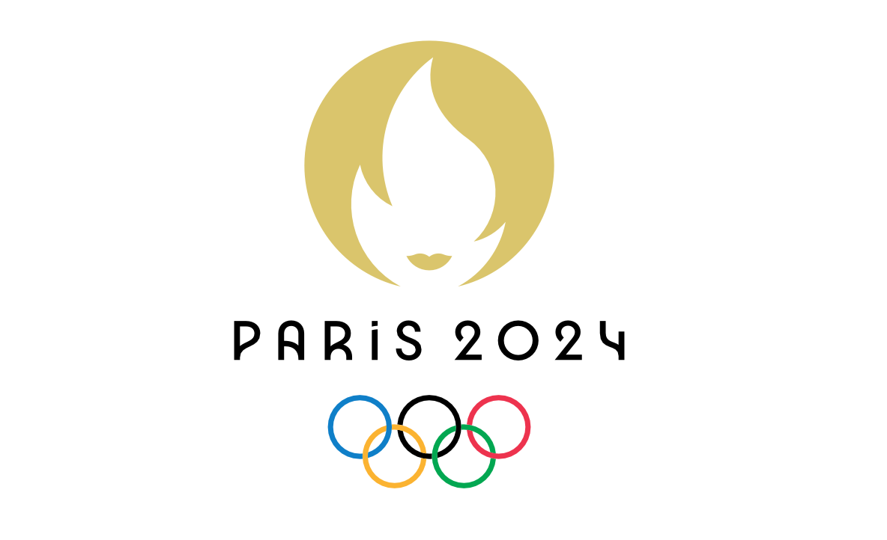

# Predicting the Olympic Medal Table - ECE046211 Final Project - Spring 2024
## Shoham Grunblat | Liad Mordechai

This project focuses on predicting Olympic outcomes using advanced machine learning techniques, specifically leveraging the Paris 2024 Olympic Games as a real-time testing ground. Inspired by the global popularity of sports predictions and the significance of the Olympics, we aim to apply transformer-based models to automate feature extraction from plain text data. Our approach utilizes Hugging Face's bert-base-uncased model, which extracts 768 features, potentially streamlining the data processing pipeline compared to traditional methods. By building on previous work in Olympic predictions and incorporating the vast, well-documented Olympic dataset, we seek to create a robust prediction system that can handle the complex, human-driven nature of sports outcomes. This project not only explores the technical aspects of machine learning in sports analytics but also taps into the cultural and social significance of Olympic predictions. The project is implemented in Python using the libraries PyTorch, NumPy, Pandas and SciKit-Learn.

  

## Table of Contents
- [Project Overview](#project-overview)
- [Project Structure](#project-structure)
- [Installation](#installation)
- [Data](#data)
- [Model](#model)
- [Results](#results)
- [Usage](#usage)
- [License](#license)
- [Authors](#authors)

## project-overview

The task of predicting the Olympic medal table is complex due to the numerous factors involved. In this project, we leverage a transformer model to extract meaningful features and predict the number of medals that each country will win. The project is part of the course ECE046211 - Spring 2024, and focuses on making the prediction process more efficient and accurate.

## project-structure
/code

    PredictingParis2024.ipynb # Main notebook containing code and analysis

/data # Folder where data is stored

/results #csv files with our predictions

README.md # Project documentation

requirements.txt # Python dependencies

## Installation

Our project is fully integrated in a Jupyter Notebook. See `PredictingParis2024.ipynb`.

### Prerequisites
|Library         | Version |
|--------------------|----|
|`Python`| `3.6.13 (Anaconda3)`|
|`matplotlib`| `3.7.4`|
|`numpy`| `1.26.4`|
|`optuna`| `3.6.1`|
|`scikit_learn`| `1.3.2`|
|`torch`| `2.3.1+cu121`|
|`transformers`| `4.42.4`|
|`torchvision`| `0.11.3`|
|`tqdm`| `4.64.1`|
|`Wikipedia-API`| `0.6.0`|
## Data

The data used in this project includes historical Olympic records, country demographics, economic indicators, and other relevant features. It is assumed that the user will download and preprocess the data following the instructions provided in the notebook.

### Data Preprocessing
- Data cleaning, normalization, and feature extraction steps are detailed in the notebook.
- Ensure that the data is correctly formatted and placed in the `/data` directory before running any scripts or notebooks.

## Model

We employed a transformer model to extract features from the input data. The model was trained using PyTorch, and the following key components were used:

- **Model Architecture**: bert-base-uncased architecture for feature extraction from Wikipedia-API; 3-layer Neural Network with Dropout and ReLU activation.
- **Training**: The model was trained on the preprocessed dataset, with key hyperparameters being learning rate, dropout rate and layer widths.
- **Evaluation**: Our loss function was MSE, with BCE being tested as well but yielding sub-optimal results. The model was evaluated using accuracy with tolerance.

### Key Hyperparameters
- Hidden Layer Widths: [961, 361, 256]
- Learning Rate: [0.001]
- Dropout Rate: [0.3235]

## Results

We predicted 5 different metrics: Gold medals, Silver Medals, Bronze Medals, Predicted Total(a prediction based on previous total tallies), and Total Predicted(the sum of the separate colour predictions). Naturally, the total predicted and the predicted total were very similar, but predicting the total straightforwardly did slightly better than predicting medals separately and adding them up. This might be due to the fact that predicting a combined number gives more margin of error and doesn't account for the internal composition.
In addition, we applied a weighted average of the medal accuracies to generate a total accuracies, taking into account that the final Olympic Table ranking prioritizes Gold, then Silver, then Bronze.

In order to avoid countries(E.G. Soviet and Eugoslavic countries) that have been separated/formed/banned along the years, and also account for the fact that our generated features are from current up-to-date data which might be unrelated to results from 50+ years ago, we filtered out data from before Barcelona 1992, leaving us with 8 Summer editions to learn from.
We used two approaches for training and testing our model: the first was to predict for all the countries which participated in Paris, and the second was to predict only for countries which had won more than six medals across the past 8 Olympics(since Barcelona).

Surprisingly(but also not, since it provides much more data to learn from and more countries to predict), the first approach did far better, as we can see:

|Name of the Model|Accuracy|
|:---:|:---:|
|Logistic Regression|85.357825%|
|MultinomialNB|85.367968%|
|Decision Tree|84.095457%|
|Random Forest|88.779773%|
|Gradient Boosting|88.514205%|
|Neural Network|87.904691%|
|NN+BERT(full, weighted)|91.23%|
|NN+BERT(full, predicted total)|91.6667%|
|NN+BERT(recency filter)|79.35%|

Where the previous model results are taken from [Olympics-Medal-Prediction](https://github.com/hrugved06/Olympics-Medal-Prediction)
The results indicate that the transformer-based approach is effective in predicting the number of medals for each country.
In addition to the improved accuracy, the biggest advantage of our approach is the simplicity of data handling compared to previous work. All we needed to do was use BERT to automatically generate hundreds of features(768, to be exact), whereas previous involved heavy data cleaning and handling and merging multiple huge datasets, which requires great amounts of RAM, in order to get a fraction of our features. When we tried running code from [Olympics 2024 predictions](https://www.kaggle.com/code/asfefdgrg/olympics-2024-predictions#2.-Identifying-and-Gathering-Data-Sources) for comparison, it reached the Colab limit 12GB RAM very quickly while merging dataframes, which is not viable.

Of course, the disadvantage of our approach is that the features BERT generates are a latent space, and so our work can't be used easily for data analysis tasks because we don't have access to the actual meaning of each feature.
## Usage

To use the model for predictions:

1. **Ensure that the data is in place and preprocessed.**

2. **Run the notebook**: Open the `PredictingParis2024.ipynb` and follow the instructions to generate predictions.

## Future Work

While working on this project, we had a few ideas for future work:
1. Since the Olympics happen continuousely every 4 years, we can treat the results as sequential data and utilize an RNN to make predictions.
2. We had BERT fetch features from Wikipedia API. As LLM's grow and develop, it might be beneficial to use one instead. We can also build a custom transformer model to get better results.
3. Dimensionality reduction can be used(e.g. PCA) to reduce the number of features while emphasizing the dominant ones.
4. We only predicted for Summer Olympics. There's a Winter Olympics coming up in 2026 :)
5. It can be interesting to build a model for specific athletes, rather than countries. This will be more complex and less suitable for our approach since there is naturally less data available about individual athletes than countries, both for feature extraction and for deep learning.

## Sources & References
### Sources
* The datasets were taken from Kaggle: [Olympic Historical Dataset From Olympedia.org](https://www.kaggle.com/datasets/josephcheng123456/olympic-historical-dataset-from-olympediaorg/data), [Paris 2024 Olympic Summer Games](https://www.kaggle.com/datasets/piterfm/paris-2024-olympic-summer-games).
* The Neural Network and Optuna implementation is taken from [ECE 046211 Tutorials](https://github.com/taldatech/ee046211-deep-learning)
* The project aims to build on a previous method review with a new approach: [Olympics-Medal-Prediction](https://github.com/hrugved06/Olympics-Medal-Prediction)
* We also found a project which was done at the same time as ours, and aimed to beat it with our approach: [Olympics 2024 predictions](https://www.kaggle.com/code/asfefdgrg/olympics-2024-predictions)
* With our deepest apologies to all Elementary school teachers out there... [Wikipedia](https://www.wikipedia.org/)
### Refrences
* [Attention is All You Need](https://arxiv.org/abs/1706.03762)
* [BERT: Pre-training of Deep Bidirectional Transformers for Language Understanding](https://arxiv.org/abs/1810.04805)
* [google-bert/bert-base-uncased](https://huggingface.co/google-bert/bert-base-uncased?text=The+goal+of+life+is+%5BMASK%5D)

## Authors

- **Shoham Grunblat** - [GitHub](https://github.com/FlyingShosho) | [LinkedIn](https://www.linkedin.com/in/shoham-grunblat/)
- **Liad Mordechai** - [GitHub](https://github.com/liadMor123) | [LinkedIn](https://www.linkedin.com/in/liad-mordechai/)
- ECE046211 - Spring 2024

## Acknowledgments

This project is a part of the ECE 046211 Deep Learning course at the Technion. We would like to express our gratitude to T.A's Lior Friedman Tal Daniel and Prof. Yossi Keshet and Daniel Soudri for their guidance and support throughout this project and the course.

## License

This project is licensed under the [MIT License](https://opensource.org/licenses/MIT).
